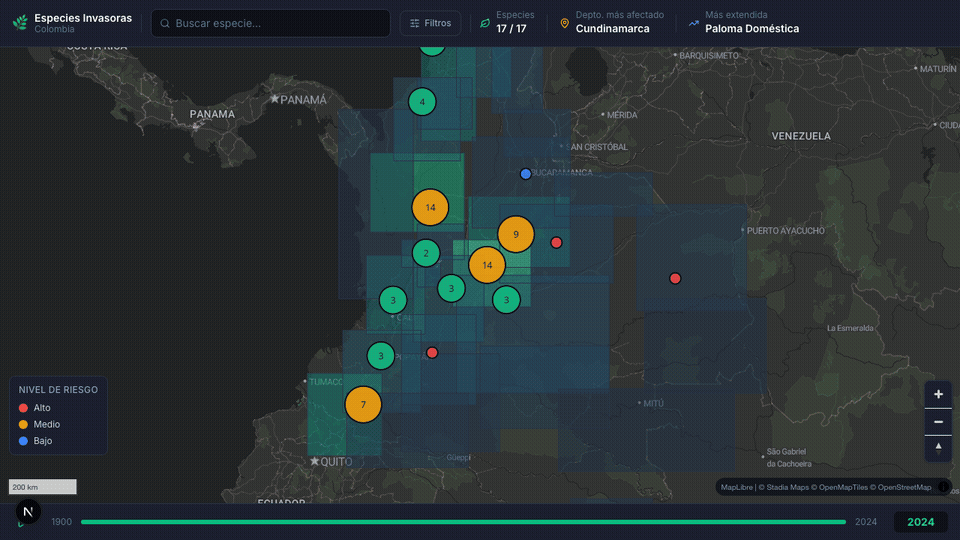

# 🌿 Mapa Interactivo de Especies Invasoras de Colombia

Aplicación web que visualiza las especies invasoras presentes en Colombia sobre un mapa interactivo, con fichas informativas, filtros y estadísticas. Datos 100% públicos y estáticos — sin backend requerido.



---

## ✨ Funcionalidades

| Característica | Descripción |
|---|---|
| 🗺️ **Mapa interactivo** | Colombia a pantalla completa con tema oscuro, clusters animados y heatmap departamental |
| 📋 **Ficha de especie** | Panel lateral con foto, taxonomía, origen, departamentos, nivel de riesgo e impactos |
| 🔍 **Filtros en tiempo real** | Por reino (Animal/Vegetal/Hongo), hábitat y nivel de riesgo |
| 🔎 **Búsqueda** | Por nombre común o científico |
| 📅 **Timeline 1900–2024** | Slider temporal con botón Play/Pause para ver la expansión histórica |
| 📊 **Stats en header** | Total de especies, departamento más afectado y especie más extendida |

---

## 🗂️ Fuentes de datos

| Fuente | Descripción |
|---|---|
| [GRIIS Colombia (GBIF)](https://www.gbif.org/dataset/168568e7-c3d6-4b0a-8b57-8163a99ac2ed) | Ocurrencias georreferenciadas por especie |
| [SiB Colombia — Res. 0067/2023](https://www.minambiente.gov.co/) | Lista oficial del Ministerio de Ambiente: 25 especies declaradas invasoras |
| [Colombia GeoJSON](https://gadm.org/) | Contornos de departamentos de Colombia |

Los datos de GBIF y SiB se sirven como archivos JSON/GeoJSON estáticos en `/public/data/`, sin dependencia de red en runtime.

---

## 🚀 Stack tecnológico

| Capa | Tecnología |
|---|---|
| Framework | **Next.js 16** (App Router, SSG) |
| Mapa | **MapLibre GL JS 5** — open-source, sin token Mapbox |
| Estilos de mapa | **Stadia Alidade Smooth Dark** (free tier) |
| UI / CSS | **Tailwind CSS 4** |
| Animaciones | **Framer Motion 12** |
| Iconos | **Lucide React** |
| Datos | JSON/GeoJSON estático en `/public/data/` |

---

## 📁 Estructura del proyecto

```
mapa-especies-invasoras/
├── app/
│   ├── layout.tsx          # Metadata SEO, fuente Inter
│   ├── page.tsx            # Página principal — orquesta estado global
│   └── globals.css         # Tokens de diseño dark theme
├── components/
│   ├── Map/
│   │   └── MapView.tsx     # MapLibre GL: clusters, heatmap, popups
│   ├── Sidebar/
│   │   ├── SpeciesCard.tsx # Ficha animada (Framer Motion)
│   │   ├── FilterPanel.tsx # Filtros: reino, hábitat, riesgo
│   │   └── StatsPanel.tsx  # Contadores en tiempo real
│   ├── Timeline/
│   │   └── TimeSlider.tsx  # Slider 1900–2024 con Play/Pause
│   └── UI/
│       ├── Header.tsx      # Barra superior
│       ├── Badge.tsx       # Badges de riesgo y tags
│       └── SearchBar.tsx   # Búsqueda por nombre
├── lib/
│   ├── speciesData.ts      # Fetching, filtrado, stats
│   └── mapConfig.ts        # Config y colores del mapa
├── public/data/
│   ├── species_info.json   # 17 especies con fichas completas
│   ├── species.geojson     # ~70 ocurrencias georreferenciadas
│   └── departments.geojson # 32 departamentos de Colombia
└── types/
    └── species.ts          # Interfaces TypeScript
```

---

## 🐛 Instalación y uso local

```bash
# Clonar el repositorio
git clone https://github.com/Vagarh/Mapa_Especies_Invasoras.git
cd Mapa_Especies_Invasoras/mapa-especies-invasoras

# Instalar dependencias
npm install

# Servidor de desarrollo
npm run dev
# → http://localhost:3000

# Build de producción
npm run build
npm start
```

---

## 🦎 Especies incluidas (17)

| Especie | Grupo | Origen | Riesgo |
|---|---|---|---|
| Pez León *(Pterois volitans)* | Pez | Indo-Pacífico | 🔴 Alto |
| Tilapia del Nilo *(Oreochromis niloticus)* | Pez | África | 🔴 Alto |
| Rana Toro *(Lithobates catesbeianus)* | Anfibio | Norteamérica | 🔴 Alto |
| Caracol Gigante Africano *(Achatina fulica)* | Molusco | África | 🔴 Alto |
| Hormiga Loca *(Nylanderia fulva)* | Insecto | Sudamérica | 🔴 Alto |
| Retamo Espinoso *(Ulex europaeus)* | Planta | Europa | 🔴 Alto |
| Buchón de Agua *(Eichhornia crassipes)* | Planta | Amazonia | 🔴 Alto |
| Kudzu *(Pueraria montana)* | Planta | Asia | 🔴 Alto |
| Trucha Arcoíris *(Oncorhynchus mykiss)* | Pez | Norteamérica | 🟠 Medio |
| Retamo Liso *(Teline monspessulana)* | Planta | Mediterráneo | 🟠 Medio |
| Kikuyo *(Cenchrus clandestinus)* | Planta | África | 🟠 Medio |
| Acacia Negra *(Acacia melanoxylon)* | Planta | Australia | 🟠 Medio |
| Trucha Café *(Salmo trutta)* | Pez | Europa | 🟠 Medio |
| Babosa *(Deroceras reticulatum)* | Molusco | Europa | 🟠 Medio |
| Pato Egipcio *(Alopochen aegyptiaca)* | Ave | África | 🔵 Bajo |
| Paloma Doméstica *(Columba livia)* | Ave | Eurasia | 🔵 Bajo |
| Icaco *(Chrysobalanus icaco)* | Planta | América tropical | 🔵 Bajo |

---

## 📄 Licencia

Datos: [CC BY 4.0](https://creativecommons.org/licenses/by/4.0/) — GBIF / SiB Colombia  
Código: MIT
